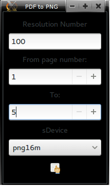
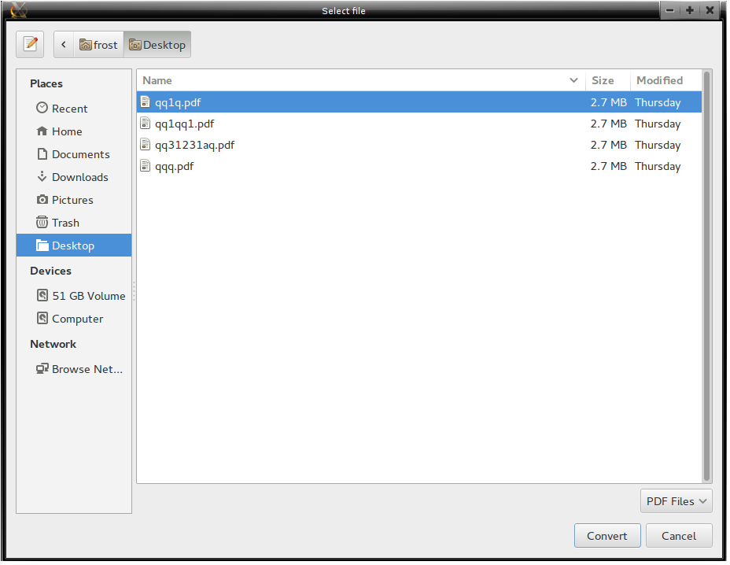

pdf2png
=======

The program has grown to full blown pdf to png converter. GNU/Linux users will be more than happier to use it :)

Always keep "From page number" lower than "To". From 10 To 90 - OK , From 90 To 10 - Not working
## Requirements

* python 
* ghostscript
* python-gobject (for debian is python-gi)
* webkitgtk, pywebkitgtk