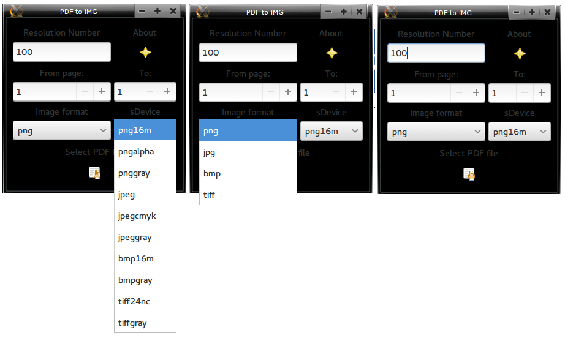
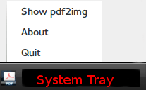

pdf2img
=======

The conversion of PDF to image has never been easier task, but with pdf2img you have the opportunity to do this with a single mouse click. pdf2img supports up to 4 different image extensions and 10 different sdevices.

Once you download the program, before starting it copy img/pdf2img_icon.png to /usr/share/icons

    sudo cp img/pdf2img_icon.png /usr/share/icons

11/11/13 name changed, from pdf2png to pdf2img and I'm saying huge THANK YOU to aaditya for the mention of "jpeg" which made me to add selection for image extensions and more sDevices, also to rename the program name.
## Requirements

* python 
* ghostscript
* python-gobject (for debian is python-gi)
* webkitgtk, pywebkitgtk